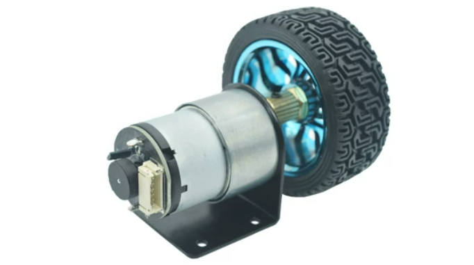
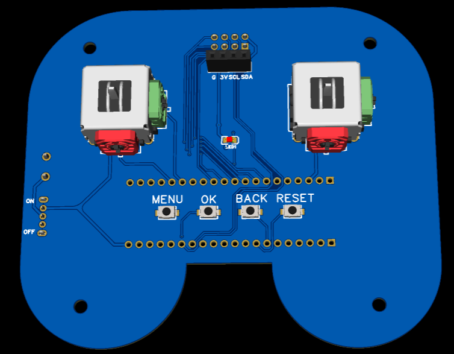

# BALANCE_CAR

### 两轮直流平衡小车

`【平衡小车定坡效果演示】 https://www.bilibili.com/video/BV1LkQ4BcEwD/`  
`【遥控调参功能演示】 https://www.bilibili.com/video/BV13gQ7BcEXu/`  

采用JGB37-520减速电机(减速比30)，含AB相编码器(11脉冲每转)


陀螺仪为MPU6050/6500，TB6612模块直接驱动两个电机  
遥控功能使用NRF24L01P 2.4G模块  
预留声波测距接口(A2、A3)和OLED接口(B8、B9)  
### 代码包含小车及遥控
为遥控器下载代码需将main.h里 宏NRF_CTRL_M_ON置为1
```c
#define NRF_CTRL_M_ON 1
```
为小车下载代码需将main.h里 宏NRF_CTRL_M_ON置为0
```c
#define NRF_CTRL_M_ON 0
```

### 上电主要流程
#### 遥控器
1、配置`SysTick` 、`LED`  
2、配置串口调试输出功能(可选)  
3、配置遥控为主控端  
    1)初始化按钮参数，配置每个实体按钮(端口、引脚、回调标识)  
    2)初始化摇杆参数，配置ADC(端口、引脚)  
    3)初始化NRF模块参数，配置SPI、配置NRF模块为发送模式并自检  
4、设置扫描周期  
5、周期性执行  
    1)扫描硬件按钮、更新按键FIFO  
    2)读取按键FIFO、将FIFO解码  
    3)打包并发送数据、接收并处理返回数据  

#### 小车
1、配置`SysTick` 、`LED`  
2、配置串口调试输出功能(可选，**注意不可和声波测距同时使用**)  
3、小车配置  
    1)初始化IIC、配置陀螺仪  
    2)配置遥控为被控端、初始化NRF模块参数，配置SPI、配置NRF模块为发送模式并自检  
    3)配置小车参数、从Flash读取小车参数(可选)  
    4)配置电机、编码器  
4、小车运行  
    1)持续接收陀螺仪产生的中断、读陀螺仪数据、更新小车数据、控制电机(不可打断)  
    2)持续读取主控端遥控指令、解析指令、控制小车运行(可打断)  


### 遥控功能简介
基于NRF24L01P绘制的2.4G无线模块，使用ACK with PALOAD 功能获取回传数据  
因此，通信频率完全由主控端(遥控器)掌控，本次的回传数据需要下一次成功发送才能获取  
及时获取回传数据：  
1、可按下无功能按钮来更新数据(目前采用方法)
```c
例如，调参时，KEY0的单击和KEY3单击无具体的功能，但遥控端已使能了对应的按键FIFO标识
BSP_KEY_Button_StructInit(&ButtonStruct,  GPIOA, GPIO_Pin_8, KEY_PL_RESET, (KEY_Flag_R|KEY_Flag_LP|KEY_Flag_DPR));
可通过单击KEY0或KEY3让遥控端发送数据从而获取被控端的ACK及回传数据
```
2、通过主控端定时发送心跳获取数据
```c
主控端以固定周期(比如200ms)发送心跳给被控端，这样可以保证在心跳周期内可以及时的获取回传数据  
同样也可以检测设备的连接状态
```
#### 硬件
遥控包含4个按钮，两个双向摇杆  


4个按钮从左到右依次为KEY0、KEY1、KEY2、KEY3  
按钮的长按触发时间、重复触发周期、双击间隔等均可在`bsp_key.h`中修改默认配置，或在每个按钮初始化时修改其配置参数
```c
BSP_KEY_Button_StructInit(&ButtonStruct,  GPIOA, GPIO_Pin_8, KEY_PL_RESET, (KEY_Flag_R|KEY_Flag_LP|KEY_Flag_DPR));
BSP_KEY_Button_Register( 0,  ButtonStruct);
BSP_KEY_Button_StructInit(&ButtonStruct,  GPIOA, GPIO_Pin_9, KEY_PL_RESET, (KEY_Flag_R|KEY_Flag_LP|KEY_Flag_DPR));
BSP_KEY_Button_Register( 1,  ButtonStruct);
BSP_KEY_Button_StructInit(&ButtonStruct,  GPIOA, GPIO_Pin_10, KEY_PL_RESET, (KEY_Flag_R|KEY_Flag_LP|KEY_Flag_DPR));
BSP_KEY_Button_Register( 2,  ButtonStruct);
BSP_KEY_Button_StructInit(&ButtonStruct,  GPIOA, GPIO_Pin_11, KEY_PL_RESET, (KEY_Flag_R|KEY_Flag_LP|KEY_Flag_DPR));
BSP_KEY_Button_Register( 3,  ButtonStruct);
```
摇杆按照从左到右，先左右后上下的顺序依次为POT0、POT1、POT2、POT3  
摇杆默认为左正右负、上正下负，直接输出控制比，无累加功能  
```c
KEY_Pot_StructInit(&PotStruct, ADC1,  ADC_Channel_0);
BSP_KEY_Pot_Register(0,  PotStruct);
KEY_Pot_StructInit(&PotStruct, ADC1,  ADC_Channel_1);
BSP_KEY_Pot_Register(1,  PotStruct);
KEY_Pot_StructInit(&PotStruct, ADC1,  ADC_Channel_2);
BSP_KEY_Pot_Register(2,  PotStruct);
KEY_Pot_StructInit(&PotStruct, ADC1,  ADC_Channel_3);
BSP_KEY_Pot_Register(3,  PotStruct);
```
#### 基础控制
**小车复位后默认关闭遥控的运动控制**

1、打开/关闭运动控制---KEY3双击  
2、打开/关闭电机-------KEY3长按  
3、进入/退出调参模式---KEY0长按  
4、左转---------------左杆左拉(POT0输出正值)  
5、右转---------------左杆右拉(POT0输出负值)  
6、前进---------------右杆上拉(POT3输出正值)  
7、后退---------------右杆下拉(POT3输出负值)  

#### 调参
1、进入/退出调参模式---KEY0长按  
2、切换所调参数--------KEY0双击  
3、切换调节步距--------左杆左拉(*10)右拉(/10)  
4、正向调节参数--------KEY1单击  
5、反向调节参数--------KEY2单击  

在退出调参模式前无法控制小车运动，**无论是否调整了参数，退出时都会自动将参数写入Flash，写入Flash后小车会抽风，需及时关闭电源或复位小车**
**调参时断开小车电源或复位小车，调节的参数将不会被保存**  
通过置`bsp_sbv.h`的宏`BSP_SBV_InitParamWithFlash`为1，  
可以选择小车初始化时使用flash里保存的参数  
置`BSP_SBV_InitParamWithFlash`为0，  
小车初始化时使用`bsp_sbv.h`里定义的默认参数

### PCB

小车和遥控pcb工程在路径`/pcb`下  

主控板pcb在 `https://github.com/HAHAHades/STM32F103C8T6_C6T6_-.git`  

其余模块pcb在 `https://github.com/HAHAHades/DC_BalancingVehicleModule.git`  

